# IT Ticket Management API - Database Schema

```mermaid
erDiagram
    %% Users and Authentication Tables
    users {
        bigint id PK "Auto-increment primary key"
        string name "User full name"
        string email UK "Unique email address"
        timestamp email_verified_at "Email verification timestamp"
        string password "Hashed password"
        string remember_token "Laravel remember token"
        timestamp created_at "Record creation time"
        timestamp updated_at "Last update time"
    }

    password_reset_tokens {
        string email PK "Email address (primary key)"
        string token "Password reset token"
        timestamp created_at "Token creation time"
    }

    sessions {
        string id PK "Session ID (primary key)"
        bigint user_id FK "Foreign key to users.id"
        string ip_address "Client IP address (45 chars max)"
        text user_agent "Browser/client user agent"
        longtext payload "Session data payload"
        integer last_activity "Last activity timestamp"
    }

    %% Main Tickets Table (10,000 records from CSV)
    tickets {
        bigint id PK "Auto-increment primary key"
        integer ticket_id UK "Unique ticket identifier from CSV"

        %% Basic Ticket Information
        string subject "Ticket subject/title"
        text description "Detailed ticket description"
        string status "Current status (Open, Closed, etc.)"
        string priority "Priority level (Low, Medium, High)"
        string urgency "Urgency level"
        string category "Ticket category"
        string type "Ticket type (Incident, Request, etc.)"
        string type_of_issue "Specific issue type"
        string item "Related item/asset"

        %% Requester Information
        string requester_name "Person who submitted ticket"
        string requester_email "Requester email address"
        string requester_location "Requester physical location"
        string requester_vip "VIP status (TRUE/FALSE as string)"

        %% Assignment and Handling
        string agent "Assigned support agent"
        string group_assigned "Assigned support group"
        string department "Department (IT, HR, etc.)"
        string workspace "Workspace/office location"

        %% Impact and Scope
        string impact "Business impact level"
        text impacted_locations "Locations affected by issue"

        %% Response and Resolution Tracking
        string first_response_status "Status of first response"
        string first_response_time_hrs "Time to first response (HH:MM:SS)"
        string initial_response_time "Initial response timestamp"
        string resolution_status "Resolution status"
        text resolution_note "Resolution details/notes"
        string resolution_time_hrs "Time to resolution (HH:MM:SS)"

        %% Interaction and Effort Metrics
        integer customer_interactions "Number of customer interactions"
        integer agent_interactions "Number of agent interactions"
        string planned_effort "Planned effort estimation"

        %% Additional Metadata
        string source "Ticket source (Portal, Email, etc.)"
        string talent_acquisition_status "TA related status"
        string survey_result "Customer satisfaction survey"
        string tags "Comma-separated tags"

        %% Time Tracking (stored as strings in CSV format)
        string created_time "Ticket creation time (M/D/YY H:MM)"
        string closed_time "Ticket closure time"
        string due_by_time "Due date/time"
        string resolved_time "Resolution timestamp"
        string last_updated_time "Last modification time"

        %% Laravel Standard Fields
        timestamp created_at "Laravel record creation"
        timestamp updated_at "Laravel last update"
    }

    %% Background Job Processing
    jobs {
        bigint id PK "Job ID"
        string queue "Queue name"
        longtext payload "Job data payload"
        tinyint attempts "Number of execution attempts"
        integer reserved_at "Job reservation timestamp"
        integer available_at "Job availability timestamp"
        integer created_at "Job creation timestamp"
    }

    job_batches {
        string id PK "Batch ID"
        string name "Batch name"
        integer total_jobs "Total jobs in batch"
        integer pending_jobs "Jobs still pending"
        integer failed_jobs "Number of failed jobs"
        longtext failed_job_ids "IDs of failed jobs"
        text options "Batch options"
        integer cancelled_at "Cancellation timestamp"
        integer created_at "Batch creation time"
        integer finished_at "Batch completion time"
    }

    failed_jobs {
        bigint id PK "Failed job ID"
        string uuid UK "Unique job identifier"
        text connection "Database connection"
        text queue "Queue name"
        longtext payload "Job payload"
        longtext exception "Exception details"
        timestamp failed_at "Failure timestamp"
    }

    %% Caching Tables
    cache {
        string key PK "Cache key (primary)"
        mediumtext value "Cached value"
        integer expiration "Expiration timestamp"
    }

    cache_locks {
        string key PK "Lock key (primary)"
        string owner "Lock owner identifier"
        integer expiration "Lock expiration time"
    }

    %% Relationships
    users ||--o{ sessions : "has many"
    users ||--o{ password_reset_tokens : "can request"

    %% Performance Indexes (documented but not shown as relationships)
    %% tickets: index on (status, priority)
    %% tickets: index on (agent)
    %% tickets: index on (requester_email)
    %% tickets: index on (ticket_id)
    %% sessions: index on (user_id)
    %% sessions: index on (last_activity)
```



## Database Schema Overview

### 🎯 **Primary Tables**

#### **`tickets` (10,000 records)**
- **Purpose:** Core IT support ticket data imported from CSV
- **Key Fields:** ticket_id (unique), status, priority, agent, requester info
- **Data Format:** Mixed - strings for dates/times, integers for counts
- **Indexes:** Optimized for common queries (status, priority, agent, email)

#### **`users` (Laravel Auth)**
- **Purpose:** System user authentication and management
- **Features:** Email verification, password reset, remember tokens
- **Integration:** Laravel Fortify for 2FA support

### 🔧 **Supporting Tables**

#### **Authentication & Sessions**
- `password_reset_tokens` - Secure password reset workflow
- `sessions` - User session management with activity tracking

#### **Background Processing**
- `jobs` - Asynchronous task queue (email, reports, etc.)
- `job_batches` - Batch job processing with failure tracking
- `failed_jobs` - Failed job debugging and retry logic

#### **Performance & Caching**
- `cache` - Application-level caching for faster responses
- `cache_locks` - Distributed locking for cache operations

### 📊 **Data Characteristics**

**Ticket Data Format (from CSV import):**
- **Dates:** `"1/8/20 1:34"` format (M/D/YY H:MM)
- **Durations:** `"28:56:23"` format (HH:MM:SS)
- **Booleans:** `"TRUE"/"FALSE"` strings
- **Counts:** Integer values for interactions

### 🚀 **Performance Optimizations**

**Database Indexes:**
```sql
-- Tickets table performance indexes
INDEX idx_tickets_status_priority ON tickets (status, priority)
INDEX idx_tickets_agent ON tickets (agent)
INDEX idx_tickets_requester_email ON tickets (requester_email)
INDEX idx_tickets_ticket_id ON tickets (ticket_id)

-- Sessions performance
INDEX idx_sessions_user_id ON sessions (user_id)
INDEX idx_sessions_last_activity ON sessions (last_activity)
```

### 🔍 **Future Normalization Opportunities**

**Current Design:** Denormalized for CSV import simplicity
**Potential Improvements:**
- Separate `agents` table (normalize agent names)
- Separate `departments` table (standardize departments)
- Separate `locations` table (normalize locations)
- Convert date strings to proper TIMESTAMP fields

**Trade-offs:**
- ✅ **Current:** Fast import, simple queries, matches CSV exactly
- ⚖️ **Normalized:** Better data integrity, more complex joins

### 📈 **Current Status**
- **Total Records:** 10,000+ tickets imported successfully
- **Storage Engine:** PostgreSQL with ACID compliance
- **Connection:** Optimized with connection pooling
- **Backup Strategy:** PostgreSQL automated backups recommended