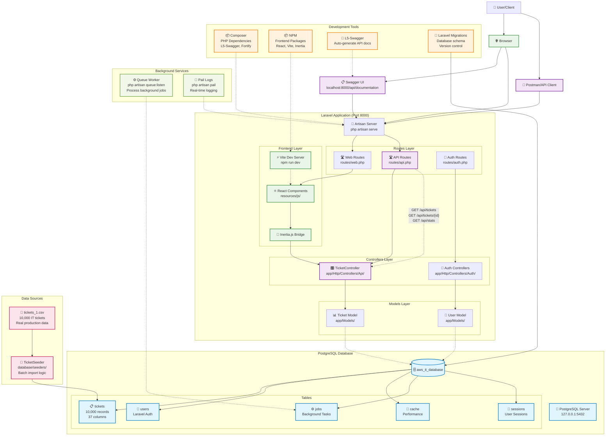

# IT Ticket Management API - Infrastructure Diagram

## Architecture Overview

**This diagram shows the complete infrastructure for the IT Ticket Management API:**

### 🏗️ **Key Components:**

1. **Frontend Layer:** React + Inertia.js + Vite for modern SPA experience
2. **Backend Layer:** Laravel 12 with clean API architecture
3. **Database Layer:** PostgreSQL with 10,000 real IT ticket records
4. **Documentation:** Auto-generated Swagger/OpenAPI docs
5. **Development Tools:** Modern PHP/JS toolchain
6. **Background Services:** Queue processing and real-time logging

### 🔄 **Data Flow:**

1. **Import:** CSV → TicketSeeder → PostgreSQL
2. **API:** Client → Routes → Controller → Model → Database
3. **Frontend:** React → Inertia.js → Laravel → API responses
4. **Documentation:** Code annotations → Swagger generator → Interactive UI

### 🚀 **Development Commands:**

- `php artisan serve` - Start API server
- `npm run dev` - Start frontend development
- `php artisan queue:listen` - Process background jobs
- `php artisan pail` - Real-time application logs
- `composer run dev` - Run all services in parallel

### 📊 **Current Status:**

- ✅ 10,000 IT tickets imported and indexed
- ✅ RESTful API with 3 endpoints documented
- ✅ PostgreSQL database optimized with indexes
- ✅ Swagger documentation auto-generated
- ✅ Full-stack development environment ready